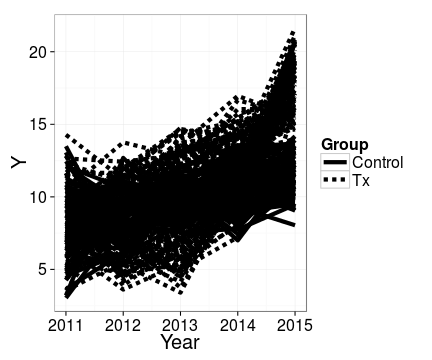
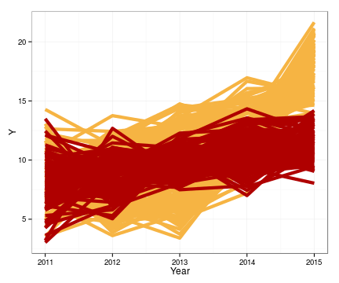
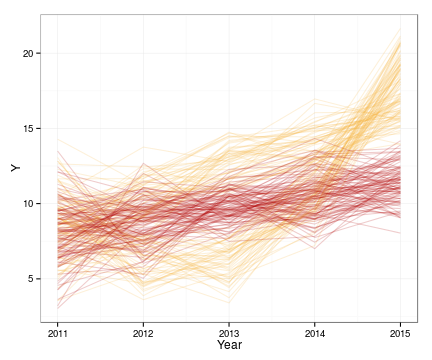
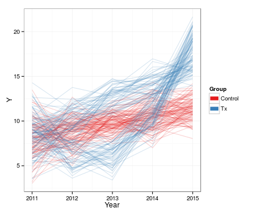
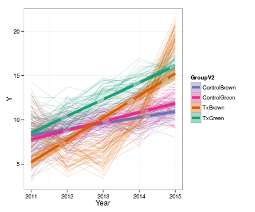
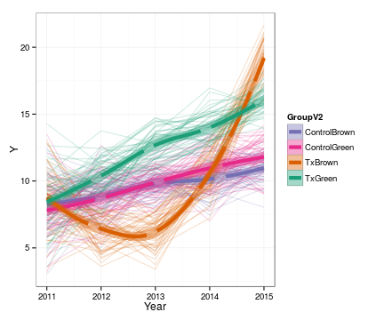

<!-- rmarkdown v1 -->

<!-- Specify the report's official name, goal & description. -->
# Graphs for the First Section of the SBS Chapter
**Report Description**: {{Put a description here, once we know more about it.}}


<!-- Point knitr to the underlying code file so it knows where to look for the chunks. -->


<!-- Load the packages.  Suppress the output when loading packages. --> 


<!-- Load any Global Functions declared in the R file.  Suppress the output. --> 


<!-- Declare any global functions specific to a Rmd output.  Suppress the output. --> 


<!-- Load the dataset.   -->


<!-- Tweak the dataset.   -->


A typical first place to start is graph points by different shape and line dashes to save funds if the anticipated journal charges extra for color, so the graph will be reproducible if someone prints grayscale copies of their presentation slides.  These might be relevant as the manuscript comes together, but we believe it is premature.  Instead of being concerned with future possible constraints, be concerned with how to understand the patterns yourself the best you can. The result is typically resembles this.  This particular graph may have an interesting structure, but who can tell?

 

At this point, we believe it's best to finese the visual elements so that the underlying trends may become noticeable.  However, too frequently the researcher immediately chooses to eliminate much of the complexity (and potential richness) of the dataset and displays on the means of the time and group, or (hopefully) both simultaneously.  {Maybe include one more graph with error bars.}

  

We advocate that instead of immediately simplifying as in the prevoius thre graphs, the researcher shelve their dainty umbrella and get into their full-body wetsuit to explore for emerging trends.  Returning to the initial line graph, we'll ignore the grayscale contraints (at least at this stage) and consider every sensible dimension to explore this potentially multivariate dataset.

Because the lines are thick and opaque, it's difficult to determine what the yellow lines look like underneath the purple.  Consequently, we'll lighten the lines by narrowing them, and decreasing it's opacity (which is specified by the color's "alpha" channel in most types of software).  Next, we'll choose a palette whose colors are balanced, so the faint yellow are not overwhelmed by the dark purple.  The resulting graph reveals that the Tx subjects apparently are not monolithic; at Time 3, some appear to go high, while others dip and then recover.  

   

After a few hours of introspection and investigation, we sift through some collected variables and find a subject's eye color interacts with the Tx protocol, but not the control protocol.

Notice this intra-group trend would have been impossible to detect with graphical methods that summarize across subjects.  A "spaghetti plot" like this is an important tool in the social and behavioral sciences where inter-indivudal differences frequently hold considerable explanatory power.  Likewise, running most confirmatory modeling approaches (like a repeated measures ANOVA or a multi-level model) is very unlikely to have suggested the pattern.  This single pattern (among many possible patterns) is fairly detectable using an appropriate graph, but would have required experiementing with several covariates and polynomial terms.

 

    


## --Session Info--

```
Report created by wibeasley at Tue 22 Jul 2014 06:02:03 PM EDT, -0400
```

```
R version 3.1.1 (2014-07-10)
Platform: x86_64-pc-linux-gnu (64-bit)

locale:
 [1] LC_CTYPE=en_US.UTF-8       LC_NUMERIC=C               LC_TIME=en_US.UTF-8        LC_COLLATE=en_US.UTF-8     LC_MONETARY=en_US.UTF-8   
 [6] LC_MESSAGES=en_US.UTF-8    LC_PAPER=en_US.UTF-8       LC_NAME=C                  LC_ADDRESS=C               LC_TELEPHONE=C            
[11] LC_MEASUREMENT=en_US.UTF-8 LC_IDENTIFICATION=C       

attached base packages:
[1] grid      stats     graphics  grDevices utils     datasets  methods   base     

other attached packages:
[1] ggplot2_1.0.0      gridExtra_0.9.1    RColorBrewer_1.0-5 scales_0.2.4       plyr_1.8.1         knitr_1.6         

loaded via a namespace (and not attached):
 [1] colorspace_1.2-4 digest_0.6.4     evaluate_0.5.5   formatR_0.10     gtable_0.1.2     labeling_0.2     MASS_7.3-33      munsell_0.4.2   
 [9] proto_0.3-10     Rcpp_0.11.2      reshape2_1.4     stringr_0.6.2    tools_3.1.1     
```
