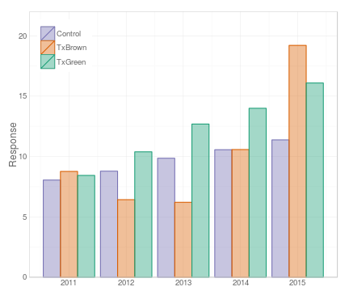
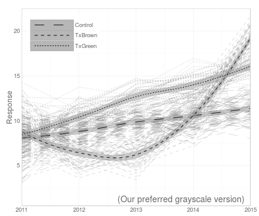
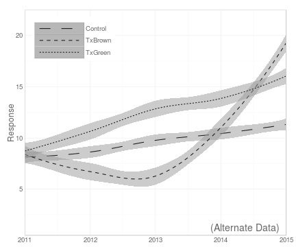

<!-- rmarkdown v1 -->

<!-- Specify the report's official name, goal & description. -->
# Graphs for the First Section of the SBS Chapter
**Report Description**: Describes how graphing details can lead to insights not possible by graphing only summaries.


<!-- Point knitr to the underlying code file so it knows where to look for the chunks. -->


<!-- Load the packages.  Suppress the output when loading packages. --> 


<!-- Load any Global Functions declared in the R file.  Suppress the output. --> 


<!-- Declare any global functions specific to a Rmd output.  Suppress the output. --> 


<!-- Load the dataset.   -->


<!-- Tweak the dataset.   -->


A typical first place to start is graphing points by different shapes and line dashes.  Two common motivations are (1) to save funds if the anticipated journal charges extra for color, or (2) so the graph will be reproducible if someone prints grayscale copies of the presentation slides.  These might be relevant as the manuscript comes together, but we believe it is premature.  Instead of being concerned with future possible constraints, be concerned with how to first understand the patterns as throughly as possible. The result sometimes resembles this graph.  It may have an interesting structure, but who can tell?

 

At this point, we believe it's best to finesse the visual elements so that the underlying trends may become noticeable.  However, too frequently the researcher immediately chooses to eliminate much of the complexity (and potential richness) of the dataset and instead presents only the means of the time and group, or (hopefully) both simultaneously.  {Maybe include one more graph with error bars.}

  

We advocate that instead of immediately simplifying as in the previous bar graphs, the researcher stowe their dainty umbrella and get into their full-length wetsuit to explore for emerging trends.  Returning to the initial line graph, we'll temporarily ignore the grayscale constraints and consider more dimensions (such as color) to explore this multivariate dataset.

Because the lines are thick and opaque, it's difficult to determine what the peach lines are doing underneath the red.  Consequently, we'll lighten the lines by narrowing them, and decreasing their opacity (which is specified by the color's "alpha" channel in most software).  Next, we'll choose a palette whose colors are balanced, so the faint peach is not overwhelmed by the dark red. (Footnote: This is not a fictitious straw-man; the peach and red color scheme was repeated used by adult males between 2012 and 2014.  This palette also included lime green and bright pink, from which you are spared.  These statisticians also dedicated an entire page to a bar graphs with two standard bars.  If only two data points need to be communicated, we recommend using much less space, and possibly including the numbers in the text or a very simple table.)  The resulting graph reveals that the treatment subjects are not monolithic; at Time 3, some go high, while others dip low and subsequently recover.  

   

After introspection and investigation, we sift through some collected variables and find a subject's eye color interacts with the treatment protocol, but not the control protocol.

Notice this intra-group trend is impossible to detect with graphical methods that collapse across subjects.  This "spaghetti plot" is an important tool in social and behavioral research where inter-individual differences frequently posses considerable explanatory power.  Likewise, most confirmatory models (like a repeated measures ANOVA or a multilevel model) are very unlikely to have uncovered this dichotomy.  Our pattern was detectable using an appropriate graph; we didn't know what caused the blue lines above to split by 2012, but at least we were aware of the pattern and could start searching.  In contrast, confirmatory modeling would have had a worse chance detecting the split, and would have required experimenting with several covariates and polynomial terms.

 

Regardless if confirmatory analyses are later run, we usually overlay the data with some type of model.  One benefit is that the model might usefully indicate trends that would be difficult to detect.  Another benefit is to illuminate discrepancies between the model and data, and to suggest superior alternatives.  In the first graph below, separate linear regressions are fit for each group across time; it inadequately describes the pronounced dipping and recovery of 'TxBrown' group.  Nonlinear models such as loess and GAM are easily overlayed in `ggplot2`  In the second graph, loess curves trace each group over time, and appear to capture the relevant features.

  

After we're satisfied that the dataset's important features are revealed, we tidy the graph to further enunciate the patterns and deemphasize the unnecessary elements.  First, the differences between the control groups appear inconsequential, and we believe we can present a more coherent case to readers if 'ControlGreen' and 'ControlBrown' are reunited.  Second, the loess standard errors are so tight that we feel the mean model prediction is unnecessary, and the error bands are sufficient descriptive.  Third, we remove the "Year" and "Group" labels because we feel they are self-explanatory, especially given their values (e.g., 2011-2015); this removes unnecessary words and space in the margin, which is then rededicated to the data.  Fourth, similar motivations suggest moving the legend from the right margin and into some unused space in the panel (which allows the plotting area to widen).  Finally, the margin text is lightened, so that it competes less with the data for the reader's attention (see "data-to-ink" ratio discussed below).

  

We conclude this section by applying these tweaks to the previous peach and red bar graph, and see what can be redeemed.  Even though a bar graph could not have detected the intra-group differences, after the trend and variables were identified with the spaghetti plot, possibly it is acceptable to summarize the dataset to outsiders.  After looking at this figure, we still believe this bar graph is inferior for two primary reasons.  The first reason is that the group trends require more effort to understand.  For instance, the dip and recovery of TxBrown takes effort to notice when it's mixed among the other bars; however the same trend is instantly recognizable in the line graph.  Furthermore, accurately determining simple patterns are much more difficult; the almost perfectly constant growth of the green and purple groups is detectable in the line graph, but muddled in the bar graph.

The second reason demonstrates how GDA and CDA can complement each other.  This (data+model) line graph allows readers to decide for themselves how well the model mimics the observed data.  The reader can see how most subjects follow their group's longitudinal nonlinear trend (unlike the linear model a few graphs ago).  Judging discrepancies like this are almost impossible with the bar graph, even if it includes error bars.

{Not only is the grapher not being transparent, they're reducing the opportunity for the reader to make their own judgment and gain insight that might not have occurred to them.} {Joe, do you want to say anything about the inductive progress?}

 

If the figure needs to be reduced to grayscale, we're in a better position than before, since we're now aware of several patterns not discoverable through a bar graph.  We have a few remarks about our prefered reduction from color.  First, the groups have a constant shade, to prevent the darker groups from giving a false impression of an increased density.  Second, the dashed patterns' on/off space is balanced, in an attempt to prevent the groups with more ink from gathering more attention.  Third, if we had used shapes, we'd attempt to balance them (for example, avoiding assigning a big dark solid circle to some groups, while assigning a thin 'x' or '+' to others). Fourth, we'd continue to develop the color version alongside the grayscale, because we can usually distribute the color version on a website or in the journal's supplemental material.

In this grayscale, the three group summaries are easily distinguished, but the individual subject lines are not, despite having different dashed patterns.  Although many of the subject-level patterns are muddled (e.g., it's difficult to determine that the three groups have almost no overlap in 2013), we still advocate retaining them.  The reader might benefit seeing how the variance shrinks from 2011 to 2012, and that the highest subjects in 2013 and 2014 were in TxGreen, while the highest subjects in 2015 were in TxBrown.
 
However we argue that the most compelling reason is to permit the reader to judge how tightly or loosely the individual scores fall near the model predictions.  Judging that conformity is very important when evaluating a model, and there's seldom a good alternative: viewing the actual subject-level variability is much more informative than viewing only the standard error bars (and certainly more informative than reading values in a table like a +/-0.71 standard error or a 4.53 between-subjects variance).  

The second graph below suppresses the subject-level information.  Peer into the empty space and imagine all the scenarios that could result in the same summary lines.  If we had been using a simple linear model instead of a flexible loess, the possibilities get considerably larger.  

Furthermore, it can be difficult to judge results from only standard error bands or bars.  Compare the second and third graphs below.  Even when they're next to each other, they don't look that different to us.  And if the graphs were scaled or sized differently, we'd have trouble noticing that the second graphs' standard error bars are considerably loser.  And yet its variance is twice as large, which is easier to determine from the fourth graph (which again supplements standard errors with individual subjects) than the third (which doesn't).

Objective impressions are facilitated by the subject data, such as few responses in 2011 exceed 12 in the first graph, while in the fourth graph, responses commonly exceed 12 as they reach up to 20.  And perhaps more importantly, subjective impressions are facilitated too.  Using the inference as an example, while we're still reasonably confident that the treatment would exceed the controls in 2015 with if a second sample had been collected, we're much less confident that the TxBrown would again surpass TxGreen.  Determinations like these lie at the hear of almost all social and behavioral analyses.

     

We'll conclude this longitudinal example with another demonstration of GDA and CDA complementing each other.  We fit two multilevel models: the first allows a quadratic relationship between the response and year (for each group), while the second treats time as categorical.  At the expense of additional complexity and perhaps a more obtuse interpretation, the categorical variable allows a more flexible relationship.  The first graph's prediction bands cannot accommodate TxBrown's deviation from a parabola, while the second graph's can.  The complexity/flexibility tradeoff is roughly balanced, judging from the two models' roughly equivalent fit indices.  Along with previous studies and theoretical justifications, these graphical comparisons can help inform the researcher's decision about which model should be presented (if not both).


## --Session Info--

```
Report created by wibeasley at Thu 24 Jul 2014 10:48:20 PM EDT, -0400
```

```
R version 3.1.1 (2014-07-10)
Platform: x86_64-pc-linux-gnu (64-bit)

locale:
 [1] LC_CTYPE=en_US.UTF-8       LC_NUMERIC=C               LC_TIME=en_US.UTF-8        LC_COLLATE=en_US.UTF-8     LC_MONETARY=en_US.UTF-8   
 [6] LC_MESSAGES=en_US.UTF-8    LC_PAPER=en_US.UTF-8       LC_NAME=C                  LC_ADDRESS=C               LC_TELEPHONE=C            
[11] LC_MEASUREMENT=en_US.UTF-8 LC_IDENTIFICATION=C       

attached base packages:
[1] grid      stats     graphics  grDevices utils     datasets  methods   base     

other attached packages:
[1] lme4_1.1-7         Rcpp_0.11.2        Matrix_1.1-4       ggplot2_1.0.0      gridExtra_0.9.1    RColorBrewer_1.0-5 scales_0.2.4      
[8] plyr_1.8.1         knitr_1.6         

loaded via a namespace (and not attached):
 [1] colorspace_1.2-4 digest_0.6.4     evaluate_0.5.5   formatR_0.10     gtable_0.1.2     labeling_0.2     lattice_0.20-29  MASS_7.3-33     
 [9] minqa_1.2.3      munsell_0.4.2    nlme_3.1-117     nloptr_1.0.0     proto_0.3-10     reshape2_1.4     splines_3.1.1    stringr_0.6.2   
[17] tools_3.1.1     
```
